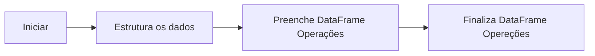

# Dashboard Products

## Índice

* [Dashboard-Products](#Título-e-Imagem-de-capa)
* [Descrição do Projeto](#descrição-do-projeto)
* [Status do Projeto](#status-do-Projeto)
* [Funcionalidades e Demonstração da Aplicação](#funcionalidades-e-demonstração-da-aplicação)
* [Acesso ao Projeto](#acesso-ao-projeto)
* [Tecnologias utilizadas](#tecnologias-utilizadas)
* [Pessoas Desenvolvedoras do Projeto](#pessoas-desenvolvedoras)

## Descrição do projeto
O Dashboard products tem o principal objetivo em mostrar as situacoes de todos os produtos de um Dataset, apresentando as situacoes de estoque atual, pedidos de compras, fotos e outros fatores.

```mermaid
graph LR;

A[Iniciar]-->B[Estrutura os dados]
B-->C[Preenche DataFrame Operações]
C-->D[Finaliza DataFrame Opereções]

```

## :hammer: Funcionalidades do projeto

- `Funcionalidade 1`: Requisita toda as informacoes dos anúncios do Seller MercadoLivre, via API.
- `Funcionalidade 2`: Consulta o preco e estoque atual da empresa. Via banco de dados, plataforma POSTGRES.
- `Funcionalidade 2a`: Compara preco e estoque atual com o antigo, realizando as próximas requisições na API. Depois atualiza o banco de dados com as novas informacoes.
- `Funcionalidade 3`: Realiza reciclagem em anúncios muitos antigos.

## 📁 Acesso ao projeto
Você pode acessar os arquivos do projeto clicando [aqui](https://github.com/E-commerce-Pecista/sales_operations).

## ✔️ Técnicas e tecnologias utilizadas

- ``Python 3.11.3``
- ``Pandas 2.0.2``

## Autores

| [ Jeferson Lopes Reis](https://github.com/jef-loppes-reis) | [ Lucas Pereira Pires](https://github.com/l-pires) |
| :---: | :---: |
